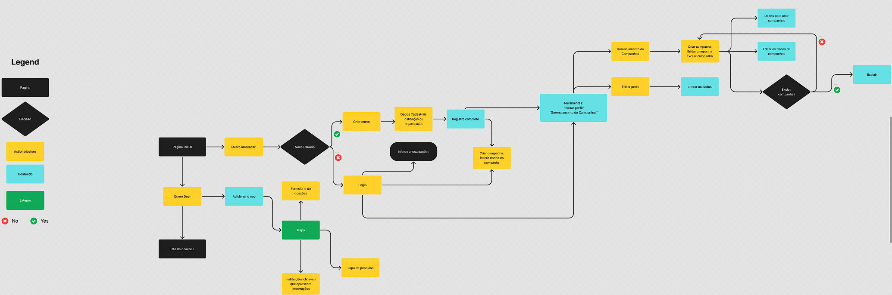

# Projeto de Interface

Aqui poderemos ver como o usuário explorará nossa plataforma e quais interfaces ele irá encontrar ao longo do uso do DoeAqui.

# UserFlow - DoeAqui

## Wireframes - DoeAqui

**Wireframe 01**

A tela descreve o requisito RF-001, disponibilizando no _header_ da página os botões "Quero Doar" e "Quero arrecadar". Além disso, é exibido ao usuário um texto informativo a respeito da importância das doações e como eles devem/podem ser feitas. Ao lado, é
exibida uma imagem de apoio. O botão "Quero Doar" redireciona o usuário para a tela de inserção de CEP (Wireframe 02) e o botão "Quero arrecadar" redireciona o usuário à tela login Wireframe 05). 

**Wireframe 02**

A tela descreve o início do requisito RF-008 e algumas informações sobre a plataforma e sobre doações. Existe um campo numérico com validador de CEPs em que o usuário pode entrar com seu CEP.

**Wireframe 03**

A tela descreve o que ocorre após o usuário inserir seu CEP. Um mapa deve ser exibido, mostrando numa circunferência com centro igual ao CEP informado e raio de 40k as instituições/organizações cadastradas, de duas maneiras. Uma, numa lista vertical, localizada
na lateral esquerda da tela. A outra, em ícones clicáveis no mapa. Ao clicar, o usuário terá acesso às informações da Instituição/Organização escolhida. Nessa tela também, o usuário poderá acessar o botão "Formulário de Doações" para acessar o recurso de doações
que não são listadas pelas instituições/organizações exibidas. No _header_ da página, ficará habilitado um campo de texto que o usuário poderá pesquisar por causas ou itens de doação. Isso ajusta o que é exibido no mapa e no menu lateral de acordo com o que ele
pesquisou. Aqui são atendidos os requisitos RF-008, RF-009 e RF-010. 

**Wireframe 04**

A tela mostra uma interface que é ativada quando o usuário clica no ícone do mapa ou na instituição/organização listada no menu lateral. Nesta interface, o usuário terá acesso às informações das campanhas ativas daquela instituição/organização. Aqui são atendidos os requisitos RF-008, RF-009 e RF-010. 

**Wireframe 05**

A tela mostra o requisito RF-002, que permite o usuário inserir seus dados de _login_ e a opção de redirecionar à tela de cadastro de contas.

**Wireframe 06**

A tela exibe o funcionamento da tela de cadastro de contas e exibe quais dados são coletadas para a criação, como prevê o requisito RF-003. 

**Wireframe 07**

A tela exibe a funcionalidade de alteração dos dados cadastrados da conta, como prevê o requisito RF-004. 

**Wireframe 08**

A tela descreve o Gerenciamento de Campanhas, como prevê o requisito RF-005 E RF-006. Aqui ele tem acesso à ferramenta que permite criar, editar ou excluir uma campanha. Também é possível acessar a edição de perfil.

**Wireframe 09**

A tela descreve a coleta de dados para a criação de uma campanha e selecionar se a campanha criada é de duração temporária ou contínua, conforme orienta o requisito RF-007. Também é possível acessar a edição de perfil.

**Wireframe 10**

A tela descreve a alteração de dados para a edição de uma campanha, conforme orienta os requisitos RF-006 e RF-007. Também é possível acessar a edição de perfil.
